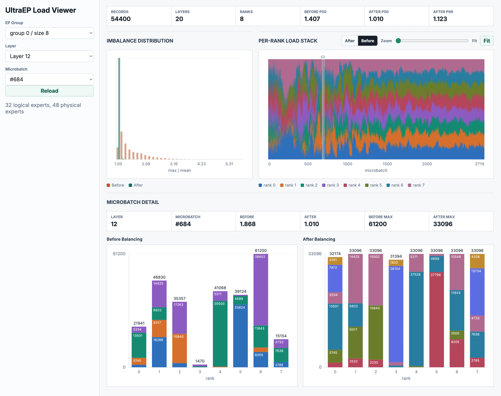

# UltraEP

UltraEP is a lightweight yet high-performance expert load balancing library for large-scale MoE training and inference. In expert parallelism (EP), load imbalance across GPUs creates a significant gap between ideal (perfect balancing) and achievable throughput. Instead of relying on stale load history, UltraEP rebalances on the **exact** post-gating load in **real time**: it replicates hot experts and reroutes tokens within every layer of every microbatch, to achieve **near-optimal** end-to-end performance.

UltraEP is a production-ready, full-stack solution rather than a standalone algorithm. It is built on the following design principles:

- **Self-contained codebase.** As an independent Python/CUDA runtime, UltraEP is decoupled from token dispatcher (e.g., DeepEP) or grouped GEMM. Integrating it into a training or inference framework takes only a few hundred lines.
- **Topology-aware replication.** Confining expert replication to the scale-up fabric, UltraEP adapts to available NVLink domain size automatically. When the NVLink domain is smaller than the EP group, the achievable imbalance floor sits slightly above the ideal 1.0.
- **Efficient, GPU-native kernels.** Highly optimized GPU-resident kernels for balancing plan solving and expert communication. Exposed overhead is under 300 µs at large-scale EP, typically 1%–2% of end-to-end step time.
- **Broad compatibility.** Works out of the box with DP/PP/VPP, activation checkpointing, FP8 weights, and CUDA graph.
- **Memory-efficient.** Cross-layer reuse of replica weight/gradient buffers minimizes additional VRAM usage, with no dynamic allocation at runtime.

For more design and evaluation details, see our [paper](https://arxiv.org/abs/2606.04101) and [technical report](https://Dots-Infra.github.io/UltraEP)

## News

- [2026/07] ✨ Released UltraEP v1.0.0, which has been deployed in our production MoE training.

## End-to-End Integration & Performance

We provide a fork of [Megatron-LM](https://github.com/Dots-Infra/Megatron-LM-UltraEP) as a reference integration of UltraEP. For a quick start, the [Megatron-LM Training with UltraEP](examples/README.md) guide includes an **8×Hopper runnable demo** with reproducible balancing gains under real training load, plus a Qwen3-235B recipe. SGLang inference integration is currently experimental and will be released once production-ready.

<p align="center"></p>

We display the overall performance on representative MoE models. Training uses EP64 (scaled by DP/PP); serving prefill uses EP40/EP64. UltraEP shows significant improvements and stays close to the force-balanced ceiling. Check our [paper](https://arxiv.org/abs/2606.04101) for detailed evaluation results.

## Installation

The requirements are:

- NVIDIA GPUs with SM90 or SM100
- Python >=3.10 and PyTorch >= 2.10
- Compiler with C++17 support
- CUDA Toolkit:
    - CUDA 12.3 or higher for SM90
    - CUDA 12.9 or higher for SM100
- NVLink for intra-node expert replication

NVSHMEM is the only dependency (will switch to the more lightweight [NCCL GIN](https://docs.nvidia.com/deeplearning/nccl/user-guide/docs/usage/deviceapi.html) in future). Install the runtime wheel and UltraEP can locate it automatically:

```bash
pip install "nvidia-nvshmem-cu13==3.4.5"
# or nvidia-nvshmem-cu12==3.4.5 for CUDA 12.x
```

Then build and install. The builder can auto-detect CUDA compute capability; if failed, explicitly set `TORCH_CUDA_ARCH_LIST` to `9.0` (SM90) or `10.0` (SM100).

```bash
python setup.py install
```

You're all set! Simply import `ultra_ep` in your Python project and get started.

## Interface

### 1. Initialization

Create one `Manager` instance per EP group. On each rank, UltraEP reserves the same number of redundant-expert slots, i.e., weight/gradient buffers reused across layers. For each layer, the external framework registers its inherent master experts' weight/gradient pointers with UltraEP for replication/reduction, and uses the redundant buffers exposed by UltraEP for MoE forward and backward compute.

```python
# (1) Initialize UltraEP Manager per EP group
manager = ultra_ep.Manager(
    group=ep_group,
    num_layers=num_layers,
    num_local_master_experts=num_experts // ep_size,
    num_local_redundant_experts=R, # redundant slots reserved per rank
    expert_fc1_numel=2 * hidden_size * moe_ffn_hidden_size,
    expert_fc2_numel=hidden_size * moe_ffn_hidden_size,
    is_train=True,
    max_microbatches=max_inflight_mbatches, # > 1 for PP/VPP, else 1
    weight_data_dtype=torch.bfloat16, # expert weight dtype
    grad_dtype=torch.float32,
    ## FP8 experts: also pass the scale dtype and numels
    # weight_scale_dtype=torch.uint8,
    # expert_fc1_weight_scale_numel=...,
    # expert_fc2_weight_scale_numel=...,
)

# (2) UltraEP exposes redundant-expert buffers,
#   which are reused across layers:
#     manager.local_replica_{fc1,fc2}_weight_buffer
#     manager.local_replica_{fc1,fc2}_grad_buffer
# (3) Register the inherent experts' weight/grad pointers per layer:
manager.construct_local_master_ptr_pool(
    layer_id, fc1_weights, fc2_weights, fc1_grads, fc2_grads
)
```

### 2. Forward and backward

After routing in the forward pass, `update_placement` computes the per-microbatch replication plan from the exact load, and `weight_sync` materializes it by distributing master weights to replica slots; both are on the critical path. `reroute` expands logical routing to physical replicas in forward and gathers gradients back to logical experts in backward. Backward reuses the saved virtual layer slot to restore replica weights before expert Dgrad, then asynchronously reduces replica Wgrad into master-expert gradients via `grad_reduce`, overlapping the reduction with router and attention backward.

```python
# --- Backward-only UltraEP hooks (identity in the forward) ---
class RestoreReplicaWeights(torch.autograd.Function):
    @staticmethod
    def forward(ctx, x, manager, vid):
        ctx.manager, ctx.vid = manager, vid; return x
    @staticmethod
    def backward(ctx, g):
        # [UltraEP] redistribute weights to replicas
        ctx.manager.weight_sync(ctx.vid, async_finish=False)
        return g, None, None

class StartGradReduce(torch.autograd.Function):
    # forward: identity ...
    @staticmethod
    def backward(ctx, g):
        # [UltraEP] start async replica -> master expert gradient reduce
        ctx.manager.gr_event = ctx.manager.grad_reduce(
            ctx.vid, async_finish=True
        ); return g, None, None

class JoinGradReduce(torch.autograd.Function):
    # forward: identity ...
    @staticmethod
    def backward(ctx, g):
        # join grad_reduce here, after the attention backward
        ctx.manager.gr_event.current_stream_wait(); return g, None

# --- One transformer layer (its backward is autograd-derived) ---
def transformer_layer(hidden, manager, layer_id):
    vid = manager.allocate_microbatch_slot(layer_id)  # PP/VPP-safe slot
    # [UltraEP, bwd-only] join grad_reduce at bwd tail
    hidden = JoinGradReduce.apply(hidden, manager)
    # --- Attention ---
    hidden = hidden + self_attention(hidden)
    # --- MoE ---
    residual = hidden
    probs, routing_map = router(hidden) # gating -> logical routing map
    # [UltraEP, fwd-only] plan replication from the exact global load
    manager.update_placement(vid, routing_map)
    # [UltraEP, fwd-only] distribute master-expert weights to replicas
    ws_event = manager.weight_sync(vid, async_finish=True)
    # [UltraEP, fwd/bwd] logical <-> physical routing (hidden under weight_sync)
    probs, routing_map = manager.reroute(vid, probs, routing_map)
    # [UltraEP, fwd-only] join weight_sync before token dispatch
    ws_event.current_stream_wait()

    # [UltraEP, bwd-only] start grad_reduce after expert bwd (async)
    hidden = StartGradReduce.apply(hidden, manager, vid)  
    recv_tokens = dispatch(hidden, probs, routing_map)
    recv_tokens = experts(recv_tokens, probs)  # grouped GEMM over physical experts
    out = combine(recv_tokens)
    # [UltraEP, bwd-only] restore weights before expert Dgrad (blocking)
    out = RestoreReplicaWeights.apply(out, manager, vid)
    return residual + out
```

## Tests

UltraEP provides two test entrypoints. `test_solving.py` runs a single-GPU placement/reroute solving with synthesized Zipf-distributed expert loads at target rank-level imbalance ratios (max/mean). `test_e2e.py` runs the distributed runtime path and further evaluates communication kernels for latency and bitwise correctness.

```bash
# Single-GPU placement/reroute simulation
python tests/test_solving.py

# Distributed runtime test
# Adjust the settings to match your cluster configuration
torchrun --nproc_per_node $GPUS_PER_NODE --nnodes $NNODES --node_rank $NODE_RANK \
    --master_addr $MASTER_ADDR --master_port $MASTER_PORT \
    tests/test_e2e.py --num-experts 256
```

The table below reports one EP64, 256-expert `test_e2e.py` run (4 master + 2 redundant experts/rank, topk = 8, tokens/rank = 8k, bf16 weights, 42 SMs for grad-reduce). The 1.01 final imbalance corresponds to the default balancing tolerance (`ULTRA_EP_QUOTA_ORACLE_EPS=0.01`):

| Initial imbalance (max/mean) | **1.51** | **2.01** | **3.03** |
| :--- | :---: | :---: | :---: |
| Final imbalance (max/mean) | 1.01 | 1.01 | 1.01 |
| `update_placement` | 0.067 ms | 0.072 ms | 0.078 ms |
| `reroute` | 0.039 ms | 0.037 ms | 0.036 ms |
| `weight_sync` (direct, no relay) | 0.214 ms | 0.265 ms | 0.317 ms |
| Critical-path bandwidth | 706 GB/s | 712 GB/s | 715 GB/s |
| `weight_sync` (adaptive relay) | 0.194 ms | 0.195 ms | 0.188 ms |
| `grad_reduce` (overlapped) | 1.935 ms | 2.181 ms | 2.425 ms |
| Replicas (max per expert / total) | 4 / 38 | 5 / 46 | 6 / 51 |

## Performance Tuning

Algorithm and kernel behaviors are controlled entirely through `ULTRA_EP_*` environment variables.

**Expert communication**

- `ULTRA_EP_GRAD_REDUCE_NUM_SMS` (default `42`): SMs reserved for the persistent grad-reduce kernel. *Tune this to your model:* profile the training and pick a small value that ensures grad-reduce is hidden fully behind the router/attention backward.
- `ULTRA_EP_GRAD_REDUCE_DETERMINISTIC` (default `1`): use the deterministic, non-atomic gradient reduction.
- `ULTRA_EP_WEIGHT_SYNC_PLAN_MODE` (default `adaptive`): weight distribution plan, one of `direct`, `adaptive`, `force_relay`. Forced to `direct` when the NVLink domain has ≤ 8 GPUs.
- `ULTRA_EP_WEIGHT_SYNC_RELAY_MIN_REPLICAS` (default `4`): minimum replica count per expert before adaptive relay is eligible.
- `ULTRA_EP_WEIGHT_SYNC_RELAY_MAX_RELAYS` (default `8`): maximum relays in a staged plan.
- `ULTRA_EP_WEIGHT_SYNC_RELAY_MIN_FANOUT_GAIN` (default `2`): minimum fanout gain required to switch to relay.

**Replication planning**

- `ULTRA_EP_BALANCE_THRESHOLD` (default `1.0`): early-stop target for the balancing binary search.
- `ULTRA_EP_QUOTA_ORACLE_EPS` (default `0.01`): numerical tolerance for the balancing ratio.
- `ULTRA_EP_QUOTA_LOCALITY_AWARE` (default `1`): locality-aware per-rank quota decomposition to cut remote traffic.
- `ULTRA_EP_QUOTA_MIN_TOKENS_PER_REPLICA` (default `1024`): minimal load allocated to a replica.
- `ULTRA_EP_QUOTA_ALLOW_ZERO_MASTER_QUOTA` (default `0`): allow zero-load master expert.
- `ULTRA_EP_QUOTA_KERNEL_STAGE` (default `1`): quota kernel stage (`0` or `1`).
- `ULTRA_EP_QUOTA_REROUTE_INTERLEAVE` (default `1`): interleave token order to avoid congestion in subsequent dispatch.

**NVSHMEM**

- `NVSHMEM_DISABLE_NCCL` (default `1`): controls the backend for UltraEP's small global-load metadata all-gather before planning. With `1`, UltraEP uses NVSHMEM-native collectives, which appears faster in larger NVLink domain. On 8-GPU RDMA clusters where the EP group spans nodes, NCCL can be faster; set to `0` and benchmark both settings.

### Load profiler and viewer

An optional profiler records per-microbatch, per-expert load before and after reroute with minor overhead, so you can diagnose the balancing effect instead of inferring it from end-to-end throughput.

- `ULTRA_EP_LOAD_PROFILING` (default `0`): enable tracing.
- `ULTRA_EP_LOAD_PROFILE_DIR` (default `$PWD/ultra_ep_traces`): trace output directory.
- `ULTRA_EP_LOAD_PROFILE_RECORD_INTERVAL` / `ULTRA_EP_LOAD_PROFILE_FLUSH_INTERVAL` (defaults `1` / `128`): how often traces are recorded and flushed to disk.

Launch the HTML viewer to browse balancing statistics and drill into rank- and expert-level details of each EP group, layer, and microbatch:

```bash
python -m ultra_ep.load_viewer --path <trace_dir> --host 0.0.0.0 --port 8765
```

<p align="center"></p>

## Acknowledgement

UltraEP draws on low-level implementations of communication kernels from [DeepEP](https://github.com/deepseek-ai/DeepEP) and [HybridEP](https://github.com/deepseek-ai/DeepEP/tree/hybrid-ep). We also thank [EPLB](https://github.com/deepseek-ai/EPLB) and [LPLB](https://github.com/deepseek-ai/LPLB) for pioneering expert-balancing schemes that inspired UltraEP's balancing design.

## Citation

```bibtex
@article{wei2026ultraep,
  title={UltraEP: Unleash MoE Training and Inference on Rack-Scale Nodes with Near-Optimal Load Balancing},
  author={Xinming Wei and Chao Jin and Tuo Dai and Yinmin Zhong and Shan Yu and Chengxu Yang and Bingyang Wu and Zili Zhang and Jing Mai and Qianchao Zhu and Zhouyang Li and Yuliang Liu and Guojie Luo},
  journal={arXiv preprint arXiv:2606.04101},
  year={2026}
}
```
