<h1 class="blog-title blog-title-zh">UltraEP: 面向大规模 MoE 训推的<span class="blog-title-nowrap">「最优」负载均衡方案</span></h1>

<section class="blog-abstract" aria-label="摘要">
  <p>在 MoE 训推框架的工程开发中，我们经常默认一个<strong>“理想假定”</strong>：路由后的专家负载已经被 force-balanced，每张卡接收的 token 数接近一致，后面的通信和计算自然也能跑满。</p>
  <p>然而，真实训练和推理中往往是另一番情形。即使算法侧引入 auxiliary loss 或 routing bias 来保障模型质量，负载均衡更多发生在统计意义上；到了每个 microbatch，热点专家仍然会频繁更替，导致理想结果和实际训推吞吐出现<strong>多达 2 倍</strong>的显著偏差。</p>
  <p>作为首个实现<strong>“精确负载+实时响应”</strong>的均衡系统，UltraEP 尝试把这个理想假设变成可落地的系统能力：在每个 microbatch 中的每层，根据确切负载，现场进行热点专家复制和 token 重路由。基于 scale-up 通信能力和对控制面+数据面的深度优化，UltraEP 在关键路径上能够保持 <strong>300 µs</strong> 以内的决策和通信开销。因此，UltraEP 从系统层面上几乎完全消除了负载不均。</p>
  <p>在 106B 到 671B 参数的主流 MoE 模型上，UltraEP 平均达到 force-balanced 理想性能的 <strong>94.3%</strong>，相比业界 SOTA 训推框架提升 <strong>1.49 倍</strong>，并将 rank 间负载不均衡（最大值 : 平均值）从 1.30–4.01 降到 <strong>1.01–1.04</strong>。UltraEP 也被应用在了大规模预训练的实际生产中。</p>

<figure class="blog-figure blog-figure-full">
  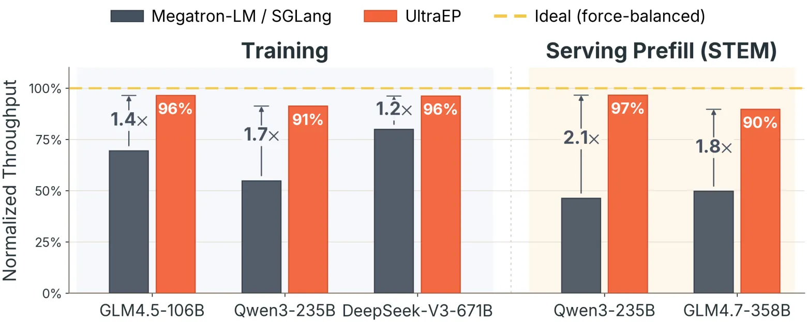
  <figcaption>UltraEP 显著提升了主流 MoE 的训推吞吐，并逼近理想性能。</figcaption>
</figure>
</section>

## 大规模 MoE 训推性能的理想-现实差距

随着大语言模型参数规模迈向万亿级别，混合专家模型（Mixture-of-Experts, MoE）凭借其“稀疏激活”的特性，在保持模型效果的同时显著降低了训练和推理成本，已成为当下最主流的模型架构。

针对 MoE 模型的架构特性，**专家并行**（Expert Parallelism, EP）被广泛用于 MoE 部署：专家分散在不同设备上，token 通过 all-to-all 通信在专家间交换。随着 MoE 模型参数量不断扩大，以及多卡间通信带宽提升，大规模专家并行（如 64 路甚至更高）在生产场景中越来越常见。

**专家负载不均衡**是影响专家并行实际性能的关键变量。由于路由的动态性，不同专家、不同设备的实时负载，也就是接收到的总 token 数，天然是不均等的。这会造成专家计算 straggler、token all-to-all 通信瓶颈、以及显存溢出。总专家数一定时，每个 rank 上放置的专家随着 EP 增大而减少，负载不均更难被平滑；因此，大规模专家并行会进一步放大这种不均衡。

<figure class="blog-figure blog-figure-full">
  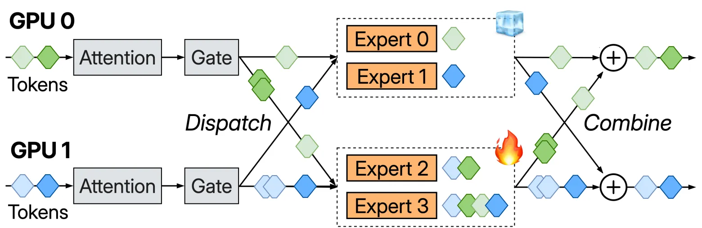
  <figcaption>MoE 专家并行（EP）以及负载不均的示意：4 个专家，EP2，top-k = 2。</figcaption>
</figure>

现有解决方案中，最具有代表性的是 [EPLB (DeepSeek, 2025)][EPLB]：它根据前一个时间窗口的历史路由信息，周期性地调整所有专家在 EP rank 间的放置。因此，这类预测性方法的有效性依赖于专家负载的静态性。

然而，我们在实际训推任务中观察到，当下主流的细粒度 MoE 模型（具有数百个“小”专家），专家负载的分布往往是**高度动态**的。这会导致对冷热专家的预测失准，使得专家均衡操作的效果减弱甚至变成负优化。

## 核心思想：基于精确负载的实时专家均衡

UltraEP 采取了一个看似激进但最直接的方案：基于门控后的**真实**负载，在每个 microbatch 中的每层都**实时**进行专家重均衡。

这个方案消除了预测引起的偏差，但是其问题也显而易见：预测性方法可以提前掩盖或平摊专家重均衡相关操作的开销，但是 UltraEP 的设定使得这部分开销暴露在**关键路径**，且在 microbatch 的最小粒度上**高频**操作。

<figure class="blog-figure blog-figure-full">
  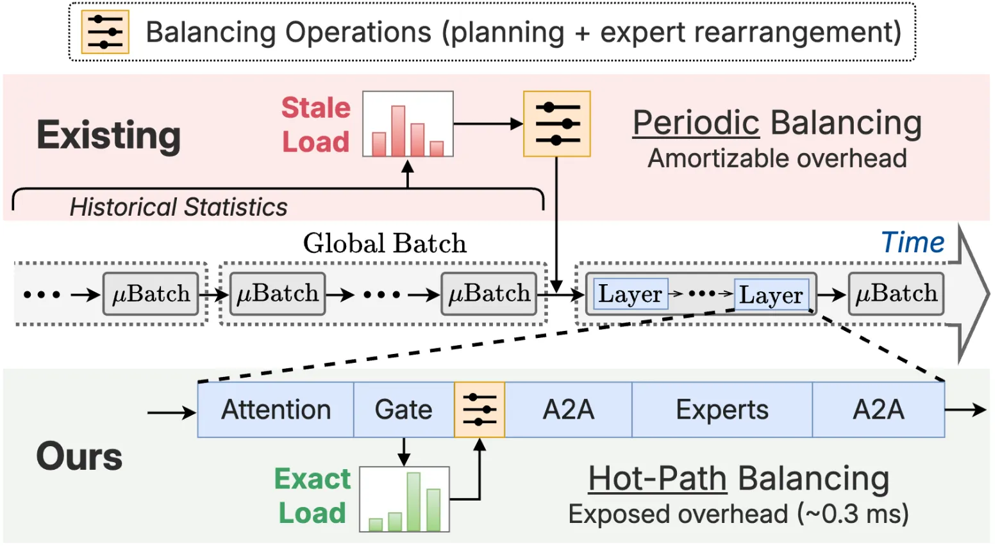
  <figcaption>UltraEP 与 EPLB 等预测性均衡方案的对比：从负载精确性、决策时机、操作频率三个方面看。</figcaption>
</figure>

基于一个**通信前提**和一系列**控制面（control plane）与数据面（data plane）优化**，UltraEP 以极低的关键路径开销，实现**近乎最优**的均衡效果和端到端性能。

首先，UltraEP 限定热点专家复制等相关通信在高带宽 scale-up 域内进行，避免跨机专家搬运。这是实现百微秒量级专家复制的通信前提。此外，新兴的**机柜级（rack-scale）节点**也显著扩大了 scale-up 域，使得整个 EP group 可以被放进高带宽互联中。

在机内通信的前提下，UltraEP 设计了一个高效的均衡方案在线求解算法，以及一套高度优化的专家权重/梯度通信算子，将均衡操作本身的开销降到最低。

## 关键设计：让最优负载均衡走进生产

UltraEP 的定位是**生产级**专家均衡库，遵循以下设计原则：

- **独立的 Python/CUDA 运行时**：UltraEP 负责冗余专家状态管理、均衡方案求解与相关的专家传输，和 DeepEP 等 token all-to-all 通信库解耦。在主流训推框架上，只需数百行的代码改动即可无缝适配。
- **GPU-native 的计算/通信过程**：UltraEP 中所有求解和通信操作都是 on-device 的，避免了与 host 侧的数据同步，并保持了与 CUDA graph 的兼容。
- **等价性与通用性**：UltraEP 不会改变 MoE 计算的数学等价性，且针对 DP/PP/VPP 等主流并行策略和 activation checkpointing、FP8 量化等机制做了一系列兼容性适配。
- **高效的显存管理**：UltraEP 通过精细管理专家状态，将额外显存开销同样控制到最低，并且在运行时没有任何动态显存分配。此外，均衡优化还有效减小了 DeepEP token 接收 buffer 的 worst-case 分配。

在这些原则的基础上，我们从如下四个方面归纳 UltraEP 的关键设计：

### 1. 专家状态布局：显存友好的 buffer 跨层复用

在训推框架侧原有专家布局的基础上，UltraEP 给每个 EP rank 预留了固定数量的 slot 用于放置复制后的冗余专家（redundant expert）。相比于模型的固有专家（main expert），冗余专家不需要维护优化器状态，因为其对应梯度也会在反传中实时归约回固有专家，而优化器状态更新也只对固有专家进行。

对于冗余专家的权重和梯度 buffer，UltraEP 采用**跨层复用**的设计，这能极大地节省显存。以 Qwen3-235B 为例，每个 EP rank 上，单个冗余专家 slot 引入的额外显存可以从 9.9 GB 降低到 108 MB。跨层复用的设计也与 UltraEP 的逐层实时操作是一致的。

<figure class="blog-figure blog-figure-full">
  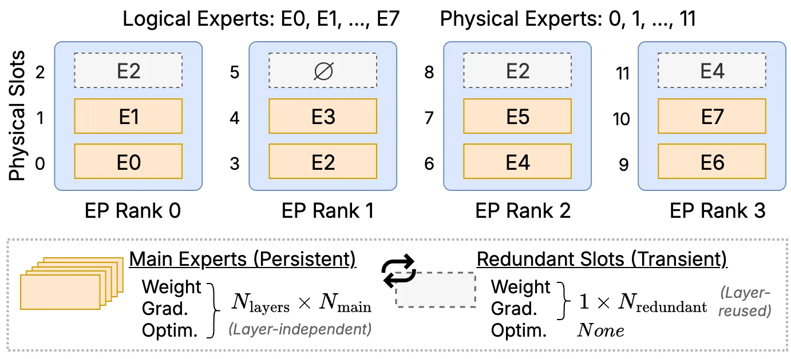
  <figcaption>UltraEP 专家内存管理示意：8 个固有专家，EP4，每 rank 有 1 个冗余专家 slot。</figcaption>
</figure>

### 2. 端到端集成：计算流-通信流的高效编排

既然 UltraEP 的定位是实时均衡，我们需要讲清楚 UltraEP 引入的额外计算和通信操作，其中哪些暴露在关键路径，哪些是可以被掩盖的。我们会展示前向、反向传播时的示意图和 Qwen3-235B 在 EP64 训练时实际的 profiling 切片，聚焦落地效果。

在前向传播中，由于数据依赖，需要在门控结束拿到全局负载信息后，UltraEP 才能进行**复制方案求解**（replication planning）和**专家权重分发**（weight distribution）的计算与通信过程。**重路由**（reroute）负责在同一个固有专家的多个副本间分流 token。相比于前两个操作，重路由更轻，且基本都可以被权重分发掩盖。

关于复制方案求解（控制面）和权重分发（数据面）的优化会在下一节讲解；这两个热路径操作会饱和 GPU SM 资源，最大化硬件利用率。总体来看，根据 EP64 下的实验结果，UltraEP 在关键路径上的额外开销维持在 300 µs 以内，仅占端到端时间的 1%–2%。

<figure class="blog-figure blog-figure-full">
  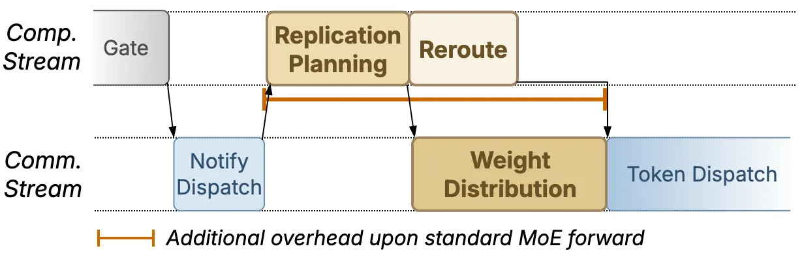
  <figcaption>前向时，专家复制求解和实际传输开销落在关键路径上。</figcaption>
</figure>

<figure class="blog-figure blog-figure-full">
  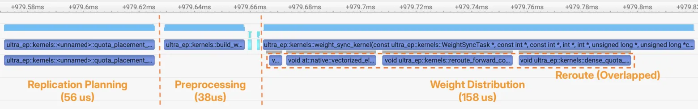
  <figcaption>在 Qwen3-235B 上，关键路径总开销基本都落在 300 µs 以内。</figcaption>
</figure>

反向传播时，和前向对偶，需要在计算 MoE Dgrad（数据梯度）前，将冗余专家的放置恢复到前向时对应 microbatch 的状态，以及在下一个 MoE Wgrad（权重梯度）计算开始前，将当前层所有专家副本的 Wgrad 归约回各自的固有专家的梯度 buffer 中，因为冗余专家的梯度 buffer 也是跨层复用的。

用户可以通过环境变量灵活控制这些通信过程的驻留 SM 数，确保它们能被计算完全掩盖。我们会在下一节介绍如何避免这些通信拖慢计算密集的反向传播主线，以及如何保证梯度归约的确定性（determinism）。

<figure class="blog-figure blog-figure-full">
  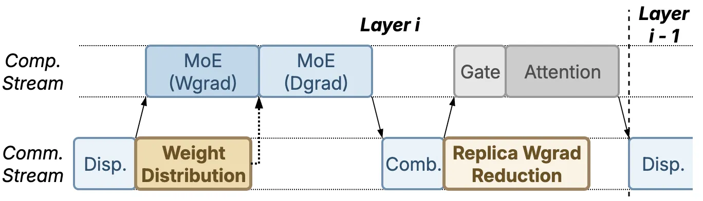
  <figcaption>反向传播中，专家权重的重分发<sup id="backward-overlap-ref"><a href="{{ page.url | relative_url }}#backward-overlap-note">1</a></sup>和专家副本的梯度归约可以和其他反向计算 overlap。</figcaption>
</figure>

<figure class="blog-figure blog-figure-full">
  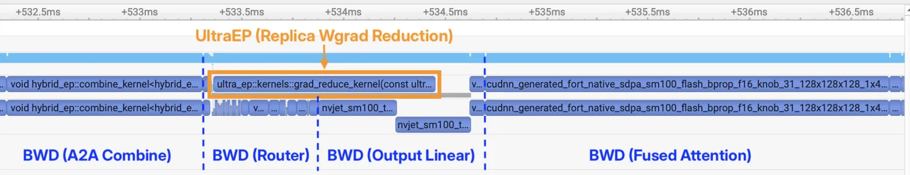
  <figcaption>对 Qwen3-235B，EP64，梯度归约通信能够完全被 router 和 attention 的反向计算掩盖，并且不拖慢这些计算。</figcaption>
</figure>

### 3. 核心算子层：控制面-数据面的极致优化

**3.1 控制面：** 挑战在于如何根据实时负载输入，快速求解出一个高质量专家均衡方案。已有方法中，EPLB 基于 LPT 贪心求解专家放置，但是无法感知实时的 token 重路由。[LPLB (DeepSeek, 2025)][LPLB] 针对 EPLB 周期性专家重放置与实时负载的偏差，通过线性规划在线调整重路由，但是其效果被可解性约束和 EPLB 放置偏差严重削弱。此外，在我们面对的大规模专家并行场景中，专家复制的解空间被指数放大。

为此，我们提出了一种 **quota 驱动的高效均衡算法**。相比于分离的专家放置和 token 重路由求解，UltraEP 直接求解每个专家实例在重路由后会接收的负载，也就是 quota，从而把这两个阶段耦合在一起：每一步探索既能实例化新的专家副本，也能更新最终负载分布。

整体算法框架对最优的全局负载均衡阈值进行高效的二分搜索。Quota 设计能够充分利用冗余专家容量，以尽可能少的专家副本达到最佳均衡效果。利用 warp-level 并行和归约能力，我们在 GPU 上实现了高效的 quota 求解算子，在 EP64 时仍然能维持 100 µs 以内的求解时间。

**3.2 数据面：** 专家权重分发和梯度归约这两个通信模式，都是高度**动态且稀疏**的。冷热专家分布变化会导致，通信方案在每层和每个 microbatch 也随着专家放置的更新而变化。针对规整集合通信的经典通信库缺乏对这种非规则通信模式的优化，而 NVLink SHARP 等 in-switch 计算卸载方案也无法支持运行时动态的局部通信组。

另外，由于少数热专家可能存在众多副本，而大部分冷专家并不需要被复制，热专家所在 rank 的向外多播（multicast）高流量会成为新的通信瓶颈。在负载非常不均衡的情况下，这会导致权重分发的性能严重劣化，甚至抵消负载均衡本身带来的收益。

为了充分利用 scale-up 物理带宽，UltraEP 首先基于持久化算子（persistent kernel）和共享内存（shared memory）double-buffering 的思路，将专家权重或梯度切分成若干 tile，利用内存语义和 TMA 进行异步的卡间数据搬运。

为了消除通信热点，UltraEP 设计了**分片流式中继**（chunk streaming relay）的通信策略，根据流量分布实时构建两阶段中继树，由低流量 rank 分摊并中转热点 rank 的出口流量。通过对 chunk（若干连续 tile）进行流式转发，而不是等待整个专家传递完成，该策略避免了昂贵的全局 barrier 和通信 bubble。

<figure class="blog-figure blog-figure-narrow">
  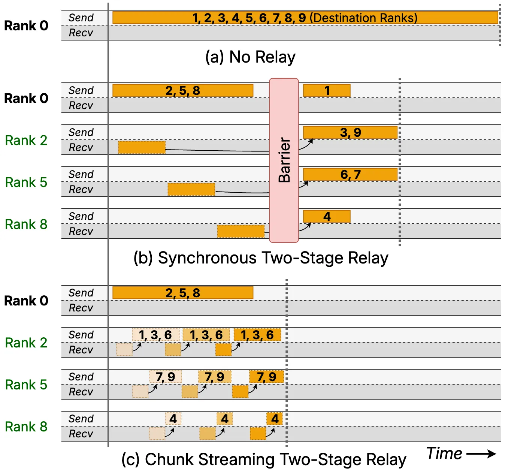
  <figcaption>热点专家 multicast 的中继方案：rank 0 上的一个专家需要被复制到 rank 1–9，其中 rank 2, 5, 8 被选为中继。图中展示源和中继 rank 沿时间线的收发状态。</figcaption>
</figure>

对于反向中的 UltraEP 通信算子，为了避免和计算产生资源争用（contention），在高效的持久化算子实现的基础上，我们精细控制 SM 占用和共享内存 footprint，使得通信和计算线程块可以被调度在同一个 SM 上。此外，为了保证浮点梯度归约的确定性，我们用保序累加代替了原子加（atomicAdd），并尽可能减少确定性实现带来的性能开销。

### 4. 效果可视化：追踪每个 microbatch 的均衡收益

在 MoE 负载均衡优化中，一个很容易被忽视的点是，如何直观地评估均衡带来的收益。现有训推框架的性能指标往往都围绕端到端的表现，比如训练中的 MFU、TFLOPS 和推理中的 TTFT、TPOT 等，用户无法根据这些指标推断出具体 EP rank 和专家的负载状态。

因此，我们在 UltraEP 中引入了一个轻量的运行时专家负载 profiler，实时采集每个 EP group，每个 microbatch 的每层中，所有专家在 token 重路由前后的负载情况。尽管不能兼容 CUDA graph，通过融合 metadata 处理算子和异步 D2H 传输，profiler 在运行时的额外开销几乎可以忽略不计。

用户可以通过 UltraEP 提供的 HTML 可视化工具链，对均衡前后的专家负载进行*层次化*分析：既能一览全局均衡度的分布统计，也能放大看每个 microbatch 中具体的冷热 rank 和专家负载。

<figure class="blog-figure blog-figure-full">
  <video autoplay loop muted playsinline preload="none" width="1267" height="697" aria-label="Profiler">
    <source src="assets/images/blog-profiler.mp4" type="video/mp4">
  </video>
  <figcaption>UltraEP 层次化负载分析：总体分布和 microbatch 细节。</figcaption>
</figure>

这套 profiler 加上可视化工具链，使得用户能够全面评估均衡算法的效果，并定位剩余瓶颈。此外，UltraEP 的接口支持可插拔的均衡算法，方便用户根据实际场景测评不同设计。未来我们会在训推框架侧引入 MoE 真实计算和通信时间的 profiling，进一步看清负载均衡带来的端到端提升。

## 实验结果

我们基于真实训推场景和典型 MoE 模型评估 UltraEP。训练全部采用 EP64 的专家并行，外层通过 DP 或 PP 进一步扩展。推理关注 prefill，根据模型专家数采用 EP64 或 EP40 并行。在训练中，我们先对 GLM4.5-106B、Qwen3-235B 和 DeepSeek-V3 三个模型进行完整预训练，然后加载训练中后期的模型 checkpoint，采用不同均衡策略续训。推理则采用 LongBench、Codeforces、DAPO-Math-17K 等数据集构建请求。训练和推理分别基于 Megatron-LM 和 SGLang 这两个框架。

<figure class="blog-figure blog-figure-full">
  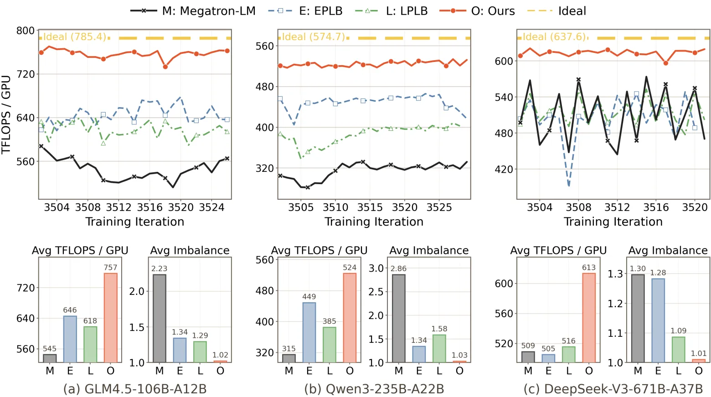
  <figcaption>训练实验结果，包括吞吐（TFLOPS/GPU）和总体均衡度。</figcaption>
</figure>

<figure class="blog-figure blog-figure-full">
  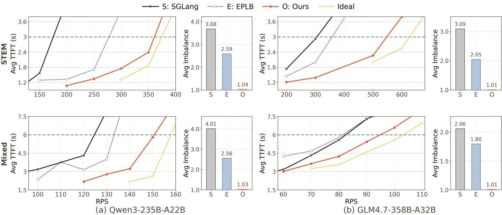
  <figcaption>推理实验结果，包括 TTFT 随每秒请求数（RPS）的变化，以及总体均衡度。</figcaption>
</figure>

在训练中，UltraEP 平均能达到理想吞吐的 94.6%，相比 Megatron-LM 提升 42%。在负载动态性更强的推理 prefill 中，UltraEP 仍达到理想吞吐的 90%–97%，相比 SGLang 提升 1.56 倍。EPLB 和 LPLB 由于历史负载滞后、复制预算受限等原因，均衡效果和端到端性能始终落后于 UltraEP。

UltraEP 在训推中将 EP rank 间不均衡稳定压到 1.01–1.04。由于 UltraEP 解决的是 rank 间总体负载不均，而非专家间的不均衡，和 force-balanced 性能上限的差距主要来自实际路由下 MoE 通信和计算对各个专家的负载非一致性，以及增加冗余专家带来的额外控制开销，而不是残余不均衡或关键路径开销。

<figure class="blog-figure blog-figure-full">
  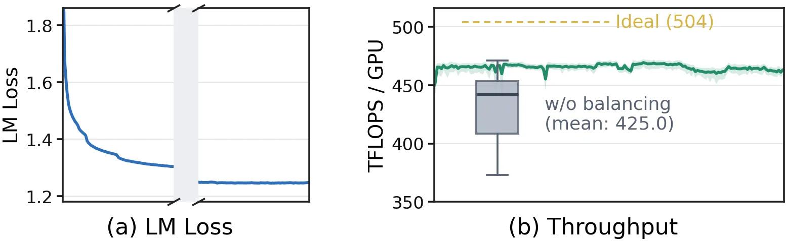
  <figcaption>生产任务中，288B 参数 MoE 预训练过程的 loss 和吞吐。</figcaption>
</figure>

UltraEP 已经在正式生产中部署。在一个 288B 参数 MoE 模型的完整预训练中，UltraEP 保持了不低于理想性能 92% 的水平，显著提升并稳定了长周期训练吞吐。

## 总结

UltraEP 的核心判断是：随着通信带宽提升，实时、精确的系统侧负载均衡会成为专家并行的基础能力。算法侧均衡负责训练稳定性和专家特化（specialization），系统侧均衡则负责把每个 microbatch 中已经发生的负载偏斜重新摊平；二者目标不同，但可以自然叠加。

UltraEP 的生产意义在于：消除 MoE 框架开发与真实训推中的性能鸿沟。它把一系列均衡操作封装在运行时内部，并把关键路径开销压到足够低，使得大规模专家并行的性能，在真实的动态负载下仍然接近理想水平。

下一步很自然的扩展是后训练场景。LLM 强化学习（RL）通常由训练和 rollout（类似批量推理）等过程交替进行。由于 RL 训练针对特定领域数据（如代码、数学等），并且没有预训练中的算法侧均衡调控，专家负载往往表现出 [ReLibra (Jin et al., 2026)][ReLibra] 观察到的，类似推理 prefill 中的强动态性。因此，UltraEP 有机会成为 MoE RL 基础设施中统一的负载调节层。

---

<p class="blog-note" id="backward-overlap-note"><small><a href="{{ page.url | relative_url }}#backward-overlap-ref">1.</a> 由于控制权重分发和 MoE Wgrad 的计算重叠需要侵入式地在 fused grouped GEMM 算子中引入同步，在开源的 Megatron-LM patch 中，我们把这部分操作放在了 MoE Wgrad 计算前，和前向时一样满载 SM 以确保极低延迟。</small></p>

## 论文与引用

**论文：** [UltraEP: Unleash MoE Training and Inference on Rack-Scale Nodes with Near-Optimal Load Balancing](https://arxiv.org/abs/2606.04101)

**作者：** **Xinming Wei**<sup>1\*</sup>, Chao Jin<sup>1</sup>, Tuo Dai<sup>2</sup>, Yinmin Zhong<sup>1</sup>, Shan Yu<sup>3</sup>, Chengxu Yang<sup>4</sup>, Bingyang Wu<sup>1</sup>, Zili Zhang<sup>1</sup>, Jing Mai<sup>1</sup>, Qianchao Zhu<sup>4</sup>, Zhouyang Li<sup>4</sup>, Yuliang Liu<sup>4†</sup>, Guojie Luo<sup>1†</sup>

<sup>1</sup>Peking University &nbsp; <sup>2</sup>Xiaohongshu Inc. &nbsp; <sup>3</sup>Shanghai AI Laboratory &nbsp; <sup>4</sup>Independent Researcher

*\*在 Xiaohongshu Inc. 实习期间完成，†通讯作者。*

如果 UltraEP 对你的研究或开发有帮助，欢迎引用：

```bibtex
@article{wei2026ultraep,
  title={UltraEP: Unleash MoE Training and Inference on Rack-Scale Nodes with Near-Optimal Load Balancing},
  author={Xinming Wei and Chao Jin and Tuo Dai and Yinmin Zhong and Shan Yu and Chengxu Yang and Bingyang Wu and Zili Zhang and Jing Mai and Qianchao Zhu and Zhouyang Li and Yuliang Liu and Guojie Luo},
  journal={arXiv preprint arXiv:2606.04101},
  year={2026}
}
```

[EPLB]: https://github.com/deepseek-ai/EPLB
[LPLB]: https://github.com/deepseek-ai/LPLB
[ReLibra]: https://arxiv.org/abs/2605.08639
