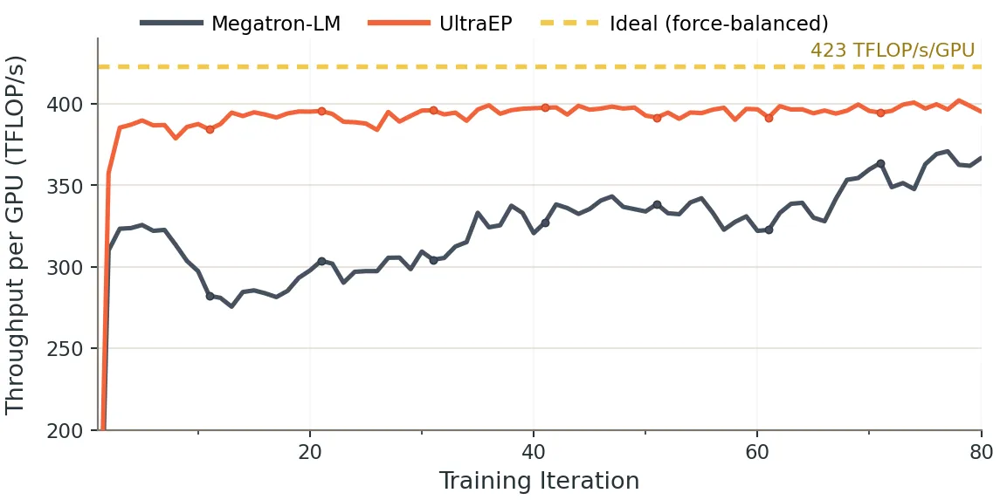
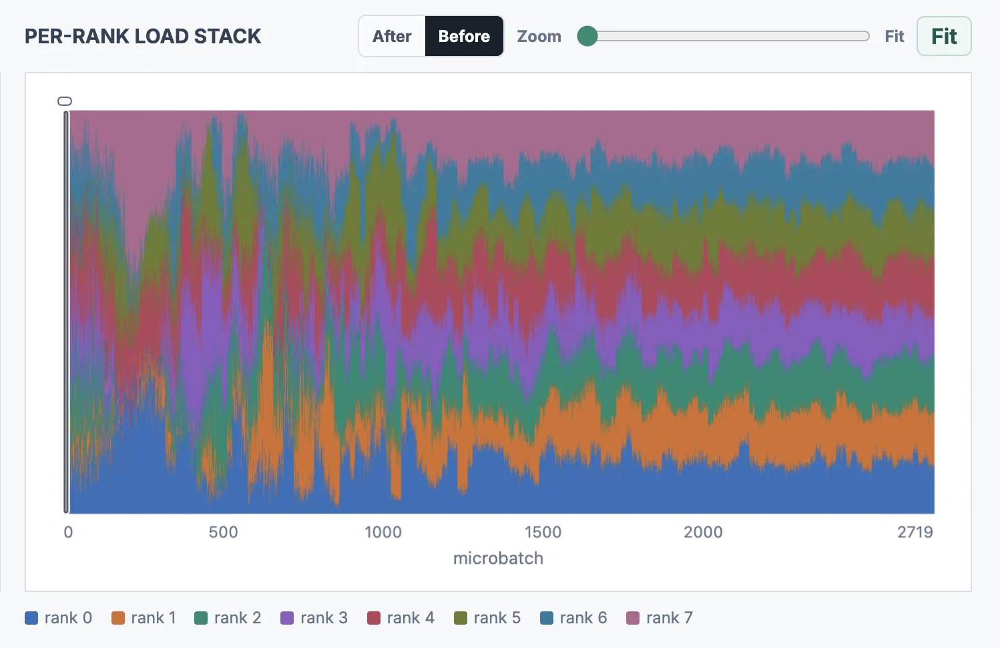
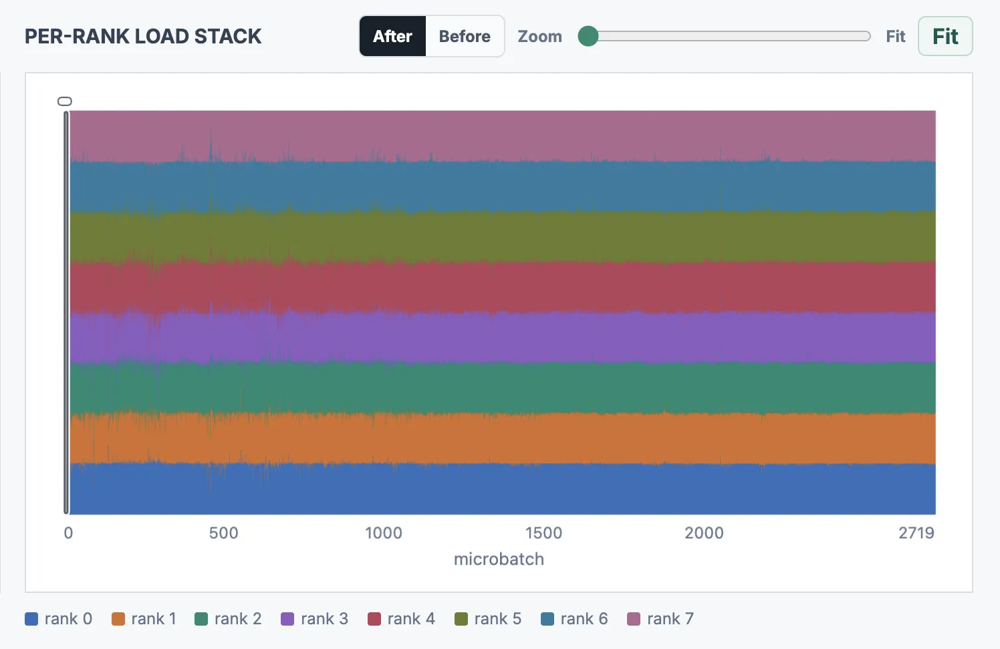

# Megatron-LM Training with UltraEP

We provide a [Megatron-LM reference](https://github.com/Dots-Infra/Megatron-LM-UltraEP) for integrating UltraEP into a MoE training framework. We also prepare a small **demo MoE** (32 Qwen3-235B-sized experts, top-k = 4, 20 layers) with real training data, which can run on a single **8×Hopper** machine so users can quickly evaluate UltraEP's load-balancing gains and emulate a large-EP run.

> UltraEP delivers its full benefit on **large-scale MoE with large EP**, where each rank holds fewer experts and rank-level imbalance is harder to smooth out. The 8-GPU demo is a scaled-down illustration; for production gains use the Qwen3-235B recipe below on a larger cluster.

## Setup

We recommend using the NGC PyTorch Docker image (25.10), which is our tested environment.

```bash
docker run --gpus all -it --rm \
    --ipc=host --ulimit memlock=-1 --ulimit stack=67108864 \
    --network=host \
    -e PIP_CONSTRAINT= \
    -e TORCH_CUDA_ARCH_LIST= \
    nvcr.io/nvidia/pytorch:25.10-py3

# Install NVSHMEM
pip install "nvidia-nvshmem-cu13==3.4.5"
```

Clone and install UltraEP.

```bash
git clone https://github.com/Dots-Infra/UltraEP /workspace/UltraEP
cd /workspace/UltraEP
python setup.py install
```

Clone and install HybridEP, an optimized branch of DeepEP-V1. DeepEP-V2 support is under testing.

```bash
git clone -b hybrid-ep https://github.com/deepseek-ai/DeepEP.git /workspace/HybridEP
cd /workspace/HybridEP
git checkout e0a5b1d9848ab3e7b4a67842bf06f067bfac67f8
# Apply a minor patch to resolve a build issue about legacy NVSHMEM dependency.
sed -i.bak '212s/.*/    disable_nvshmem = True/' setup.py
python setup.py install
```

Clone Megatron-LM with UltraEP integration.

```bash
git clone https://github.com/Dots-Infra/Megatron-LM-UltraEP /workspace/Megatron-LM
```

## Data

To reproduce the demo under realistic, non-uniform load, download and extract our preprocessed [RedPajama-Data-1T](https://huggingface.co/datasets/togethercomputer/RedPajama-Data-1T) (1B-token sample, packed as a `bin`/`idx` pair readable by Megatron-LM) and the [Qwen3](https://huggingface.co/Qwen/Qwen3-235B-A22B) tokenizer. These redistributed artifacts are provided solely for reproducing this demo; refer to the upstream dataset/model pages for their licenses and notices.

```bash
mkdir -p /workspace/data

wget -O /workspace/data/redpajama_1b_qwen3.tar.gz \
    https://github.com/Dots-Infra/UltraEP/releases/download/v1.0.0/redpajama_1b_qwen3.tar.gz
wget -O /workspace/data/qwen3_tokenizer.tar.gz \
    https://github.com/Dots-Infra/UltraEP/releases/download/v1.0.0/qwen3_tokenizer.tar.gz

tar -xzf /workspace/data/redpajama_1b_qwen3.tar.gz -C /workspace/data
# -> redpajama_1b_qwen3.{bin,idx}

tar -xzf /workspace/data/qwen3_tokenizer.tar.gz -C /workspace/data
# -> qwen3_tokenizer/
```

## Run

Launch the demo on 8 GPUs:

```bash
MEGATRON_PATH=/workspace/Megatron-LM \
DATA_PATH=/workspace/data/redpajama_1b_qwen3 \
TOKENIZER_PATH=/workspace/data/qwen3_tokenizer \
ENABLE_ULTRA_EP=1 \
NUM_REDUNDANT_EXPERTS_PER_RANK=2 \
ULTRA_EP_LOAD_PROFILING=1 \
EP_SIZE=8 \
bash /workspace/UltraEP/examples/train_demo_moe.sh
```

To view balancing effect at any time, simply run:

```bash
python -m ultra_ep.load_viewer --path <output_dir>/expert_loads
```

For a quick run without data, set `MOCK_DATA=1`; it uses near-uniform random tokens, so UltraEP will show little gain. Use the real dataset for meaningful load-balancing results.

## Results

On the 8×Hopper demo, UltraEP holds throughput close to the ideal (92%+):

<p align="center"></p>

The load viewer shows per-microbatch load among ranks before and after UltraEP balancing:

<p align="center">
  
  
</p>

## Scaling up: Qwen3-235B

For a production-scale run, use `train_qwen3_235b.sh` (94 layers, 128 experts, top-k = 8, EP64). Similarly set the `MEGATRON_PATH`, `DATA_PATH`, and `TOKENIZER_PATH`, then launch across your cluster. We recommend at least 256 GPUs. If you hit OOM while getting started, reduce `--num-layers` in the script for a quick fit.
